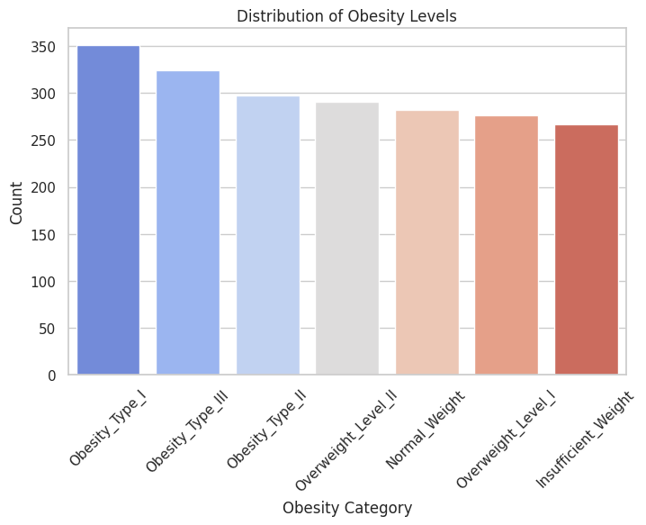
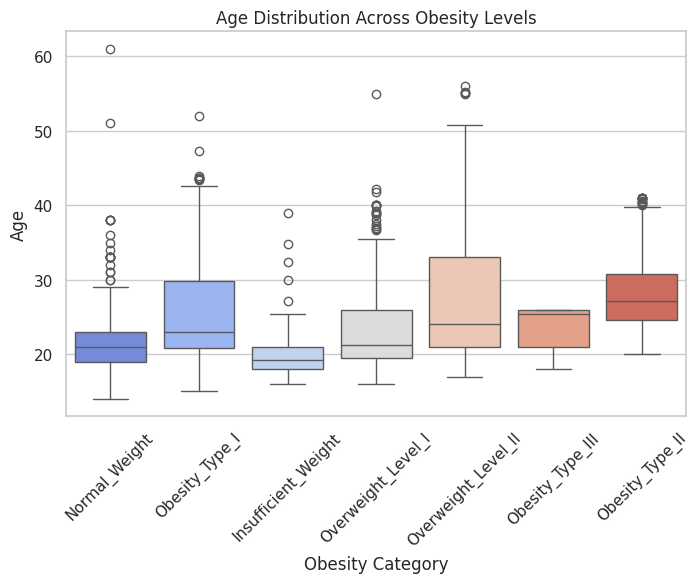
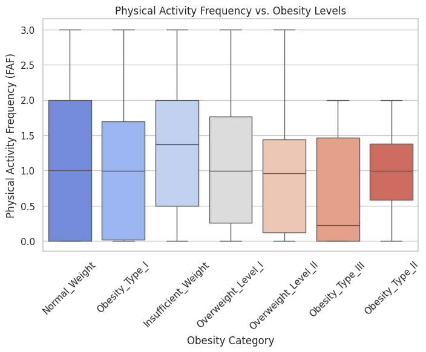
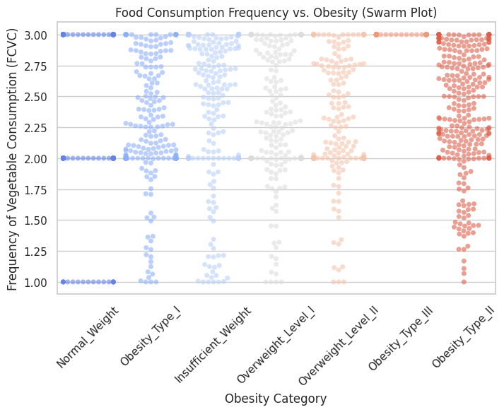
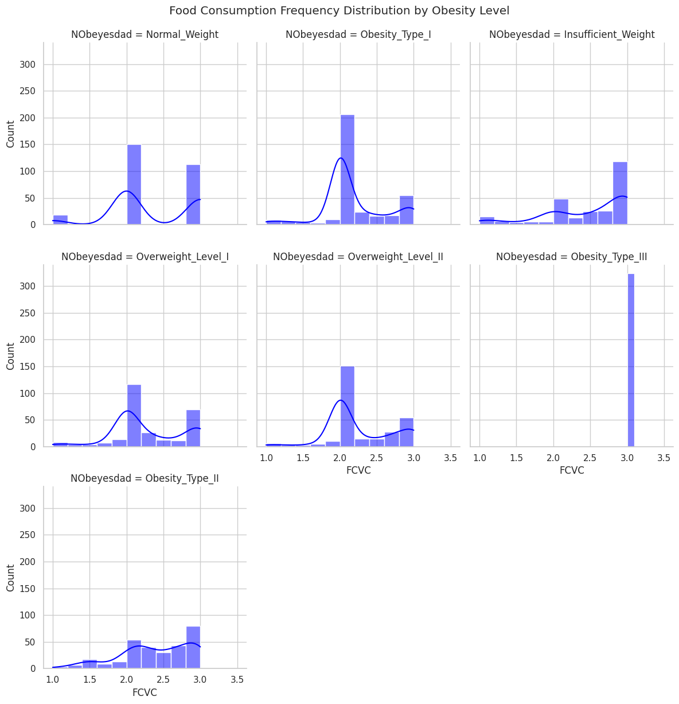
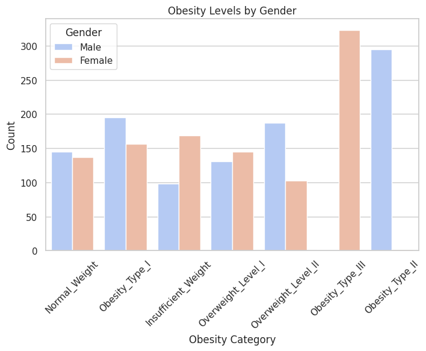
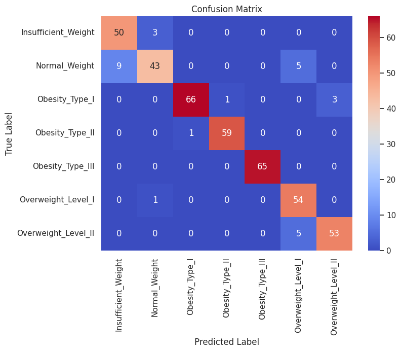

# Obesity Level Classification Using Deep Learning

## Project Description

Built a deep learning model to classify obesity levels using demographic and lifestyle data. The project uses a fully connected neural network trained on tabular data and achieves high classification accuracy across multiple obesity categories.

## Dataset

**File name:** Obesity.csv  
**Total records after cleaning:** 2087  
**Total features:** 16  
**Target variable:** NObeyesdad  

### Target Classes

- Insufficient Weight  
- Normal Weight  
- Overweight Level I  
- Overweight Level II  
- Obesity Type I  
- Obesity Type II  
- Obesity Type III  

The dataset includes age, gender, height, weight, food habits, water intake, physical activity, smoking, alcohol consumption, family history, and transportation mode.

## Data Cleaning and Preparation

You performed the following steps.

- Checked data types and structure  
- Verified there were no missing values  
- Removed duplicate rows, 24 duplicates removed  
- Scaled numeric features using StandardScaler  
- One hot encoded categorical features  
- Encoded target labels using LabelEncoder  
- Final feature count after encoding, 31  

## Exploratory Data Analysis

Analyzed patterns and relationships using visualizations.

### Obesity Class Distribution

 
### Age variation across obesity levels  

### Physical activity frequency vs obesity 

### Food consumption vs obesity 

### Gender based obesity comparison

## Train Test Split

- Training data, 80 percent  
- Testing data, 20 percent  
- Stratified split to maintain class balance  

## Model Architecture

Implemented a neural network with the following structure.

- Input layer with 31 features  
- Dense layer with 128 neurons and ReLU activation  
- Dropout layer with rate 0.3  
- Dense layer with 64 neurons and ReLU activation  
- Dropout layer with rate 0.2  
- Dense layer with 32 neurons and ReLU activation  
- Output layer with 7 neurons and Softmax activation  

**Total trainable parameters:** 14663  

## Training Strategy

- Optimizer, Adam  
- Learning rate, 0.001  
- Loss function, categorical cross entropy  
- Batch size, 32  
- Epochs, up to 50  
- Validation split, 20 percent  
- Early stopping with patience of 5  
- Learning rate reduction on plateau  

## Model Evaluation

**Test accuracy:** 93 percent  

### Class Wise Performance

| Obesity Class | Precision | Recall | F1 Score |
|--------------|----------|--------|---------|
| Insufficient Weight | 0.85 | 0.94 | 0.89 |
| Normal Weight | 0.91 | 0.75 | 0.83 |
| Overweight Level I | 0.84 | 0.98 | 0.91 |
| Overweight Level II | 0.95 | 0.91 | 0.93 |
| Obesity Type I | 0.99 | 0.94 | 0.96 |
| Obesity Type II | 0.98 | 0.98 | 0.98 |
| Obesity Type III | 1.00 | 1.00 | 1.00 |

## Results Visualizations

### Confusion Matrix

## Ayesha Javaid

